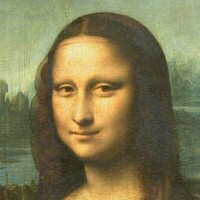
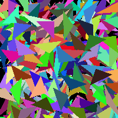
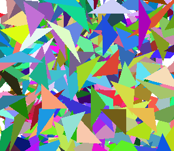

# Polygon GA


A little experimentation app to try and evolve images using polygons. It wasn't really
made with scallability in mind - I did it to try and build a GA in C# and maybe use some 
concurrency to improve performance.

This app tries to evolve images using either squares or triangles. The images below will show
a couple examples of this. Additional polygon shapes could also be added pretty easily. This
a formal experiment on the best way to evolve images, most of the parameters and operations
used were through simple trial and error.

## Crossover

A couple of crossover operators were used, such as
- Single point
- Two point
- Uniform

The example images below were generated with single point crossover simply because it looked like it had the most "accurate" result.

The crossover operators are behind an interface so new ones could easily be built and plugged in, simply implement the `ICrossover` interface.

## Selection

Only tournament selection was used, with the tournament size usually being about 5-10% of the  population.

Additional selection mechanisms can be added through the `ISelection` interface.

## Mutation

Probably one of the most important components of this project. Initially, the images in the
population are just a jumble of random shapes and colours all over the place. The mutation
would need to cater for moving polygons around and, changing their colour and size. A number
of mutation operators were added and used during runtime to target random polygons in each 
solution. These operations are,
- Changing to a random colour
- Growing
- Shriking
- Moving
- Rotating
- Shearing
- Swapping layer (z-level)

Multiple mutations could be applied to a single solution, provided the mutation rate was met.

More mutations could be added using the `IMutation` interface.

## Fitness

The fitness of each solution was computed against a target image (The image you're trying to evolve). Each fitness value was computed simply as the sum of the squared differences for each
colour (RGB) for a given pixel in the source and target images.

```
// For all pixels in the images.
fitness += Math.Pow(targetPixel.R - srcPixel.R, 2)
            + Math.Pow(targetPixel.G - srcPixel.G, 2)
            + Math.Pow(targetPixel.B - srcPixel.B, 2)
```

A new fitness function can be added by implementing the `IFitness` interface.

## Polygon Generation

Polygon generators are used to generate a single polygon. These generators can be used to 
construct polygons with certain requirements i.e square or triangle. These are only used
during the initialization of the population but could easily be used in a new mutation 
operator. 

The generators used in this project are,
- `SquarePolygonGenerator`
- `TrianglePolygonGenerator`

Additional operators can be added using the `IPolygonGenerator` interface. As mentioned earlier,
these generators are used seperately. There was no mixing of polygons in my runs but that can
really easily be achieved. 

## Results

### Evolution with squares

 

 

 


### Evolution with triangles

 

 

 
